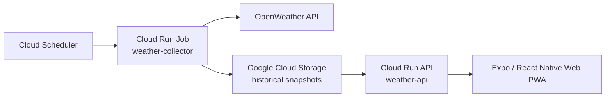

<p align="center">
  
</p>

<h1 align="center">Weather Forecast Validation</h1>

<p align="center">
  Observed weather vs. forecasts made 1–5 days earlier.
</p>

<p align="center">
  <a href="https://hvonkent-weather-app.expo.app"><strong>Live app</strong></a>
</p>

## Overview

Weather Forecast Validation is a small production weather-data platform that preserves historical forecast snapshots and later compares them with observed weather.

The key idea is **forecast preservation**. A normal weather app usually shows only the latest forecast. Once that forecast changes, the earlier prediction is gone. This project stores forecast snapshots over time so forecasts made 1–5 days earlier can be evaluated against what actually happened.

The system collects weather data for:

- Amsterdam, Netherlands
- Bremen, Germany
- Munich, Germany
- Rochester, Minnesota, USA
- Boston, Massachusetts, USA

## Features

- Current-weather overview for all configured cities
- Historical forecast validation for forecasts made 1–5 days earlier
- 3-day, 7-day, and 14-day validation windows
- Seven validation metrics:
  - temperature
  - feels-like temperature
  - humidity
  - wind speed
  - cloud cover
  - probability of precipitation
  - 3-hour precipitation amount
- Actual observations shown in orange and forecast horizons in blue
- Point-by-point error heatmaps and summary statistics
- Mean Absolute Error (MAE) for continuous variables
- Brier error / Brier score for probability of precipitation
- Metric and Imperial display modes without additional weather API requests
- City-local date/time rendering using IANA time zones
- Responsive web UI and installable PWA
- Charts open with the latest data visible immediately

## Architecture



The runtime architecture is intentionally small:

- **Cloud Scheduler** starts the collector hourly.
- **Cloud Run Job** requests current conditions and the 5-day / 3-hour forecast from OpenWeather.
- **Google Cloud Storage** keeps timestamped JSON snapshots rather than overwriting old forecasts.
- **Cloud Run API** exposes the latest weather and retrospective validation data.
- **Expo / React Native Web** provides the responsive frontend and PWA.

The storage bucket remains private. The frontend talks only to the public, read-only API.

## Forecast validation methodology

Validation is evaluated at 3-hour target times.

For each target time, the backend finds:

1. the closest available observed weather measurement;
2. a forecast made approximately 24 hours earlier;
3. a forecast made approximately 48 hours earlier;
4. a forecast made approximately 72 hours earlier;
5. a forecast made approximately 96 hours earlier;
6. a forecast made approximately 120 hours earlier.

This produces five forecast horizons: **1 day through 5 days ahead**.

For continuous metrics, the app visualizes point error and aggregates it using Mean Absolute Error:

```text
absolute error = |forecast - observed|
```

For probability of precipitation, it uses squared probability error and the Brier score:

```text
Brier error = (forecast probability - observed outcome)^2
```

Matching and storage are handled in UTC. City-local time zones are applied only for display.

## Metric and Imperial display

Weather data is stored and served in a canonical metric representation. Switching display systems happens entirely in the frontend; it does **not** trigger a second request to OpenWeather.

Examples:

| Metric | Imperial |
| --- | --- |
| °C | °F |
| m/s | mph |
| mm | in |
| 24-hour time, e.g. `17h` | 12-hour time, e.g. `5pm` |
| DD/MM/YYYY | MM/DD/YYYY |

Humidity, cloud cover, probabilities, and Brier scores do not require unit conversion.

## Frontend behavior

The homepage is a current-weather summary. Each city links to a dedicated forecast-validation page.

The validation page uses expandable metric sections. Temperature starts expanded; the remaining metrics can be opened independently. Each expanded section contains:

- observed-vs-forecast chart;
- 1–5 day forecast horizon legend;
- absolute-error or Brier-error heatmap;
- summary performance statistics.

Validation charts retain a tick at every 3-hour target point and a text label every other point (every 6 hours). Local-midnight boundaries are shown with dashed vertical separators.

## Tech stack

### Frontend

- Expo
- React Native / React Native Web
- TypeScript
- Expo Router
- react-native-svg
- Expo Hosting / EAS Deploy

### Backend and data pipeline

- Python
- Flask
- Google Cloud Run
- Google Cloud Run Jobs
- Google Cloud Scheduler
- Google Cloud Storage
- Google Secret Manager
- OpenWeather API

## Repository structure

```text
weather-app/
├─ assets/
│  └─ images/
├─ public/
├─ src/
│  ├─ app/
│  │  ├─ +html.tsx
│  │  ├─ index.tsx
│  │  └─ city/
│  │     └─ [city].tsx
│  ├─ components/
│  │  ├─ ValidationMetricChart.tsx
│  │  ├─ ValidationPerformanceMetrics.tsx
│  │  └─ validationMetrics.ts
│  ├─ services/
│  │  └─ weatherApi.ts
│  └─ utils/
│     └─ dateTime.ts
├─ weather-api/
├─ weather-job/
├─ setup-pwa.ps1
├─ AGENTS.md
└─ README.md
```

## Local development

Install dependencies and configure the frontend API URL:

```powershell
npm install
```

Create a local `.env` file:

```text
EXPO_PUBLIC_WEATHER_API_URL=https://your-weather-api.example.com
```

Then start the web app:

```powershell
npx expo start --web
```

The `.env` file should remain untracked.

## PWA branding

The project includes a PowerShell helper that regenerates the PWA manifest, browser icons, Apple touch icon, and Expo HTML metadata from `assets/images/icon.png`:

```powershell
.\setup-pwa.ps1
```

The compact installed-app name is **WFV** and the current theme color is orange (`#f97316`).

## Deployment

Export the static Expo web build first:

```powershell
npx expo export --platform web
```

Only if the export succeeds, deploy it:

```powershell
eas deploy --prod
```

Production:

https://hvonkent-weather-app.expo.app

The API is deployed separately to Google Cloud Run.

## Security and repository hygiene

No API keys or service-account credentials are required in the frontend repository.

- The OpenWeather API key belongs in Google Secret Manager.
- Do not commit `.env` files containing secrets.
- Do not commit service-account JSON files, private keys, or downloaded credentials.
- The Cloud Storage bucket is private.
- The public API is read-only.

Before publishing a fork or deploying your own copy, configure your own Google Cloud resources and secrets rather than reusing production credentials.

## Why I built this

This project is primarily an engineering and data-validation project rather than a conventional weather viewer. It combines automated data collection, historical snapshot preservation, cloud deployment, API design, responsive visualization, time-zone handling, and forecast-error analysis in one end-to-end system.
